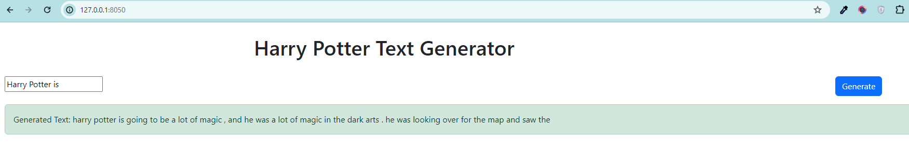

# Harry Potter Text Generation Web Application

## Overview

This repository contains a NLP project that uses a Long Short-Term Memory (LSTM) network to generate text based on the Harry Potter book series by J.K. Rowling. It includes data preprocessing, model architecture, training, and a web application for text generation.

## Dataset Description

The dataset consists of text from all seven Harry Potter books. Each row in the dataset represents a chapter, including the chapter's text, number, and book number. It's an excellent resource for Natural Language Processing (NLP) tasks like text analysis, sentiment analysis, and character network analysis.

The dataset is sourced from the [Harry Potter Text Mining project on GitHub](https://github.com/ErikaJacobs/Harry-Potter-Text-Mining/), designed for academic and non-commercial use.

## Model Architecture

The LSTM model is built to handle sequences and dependencies in text data. It includes:
- An embedding layer for vector representation of tokens.
- An LSTM layer for sequence processing.
- A dropout layer for regularization.
- A fully connected layer for output prediction.

## Training and Evaluation

The model is trained using cross-entropy loss and gradient clipping to prevent exploding gradients. Learning rate adjustments are based on validation set performance. The model's performance is measured using perplexity on validation and test datasets.

## Web Application Development

### Features

The web application provides an interface where users can input a text prompt, and the model generates a continuation of the text. For example, given the prompt "Harry Potter is", the model might generate "a wizard in the world of Hogwarts."

### Running the Application Locally

To run the application:

1. Install Dash with `pip install dash`.
2. Clone the repository and navigate to the application directory.
3. Run the application with `python main.py`.
4. Access the application at [http://127.0.0.1:8050/](http://127.0.0.1:8050/).

### How It Works

The application interfaces with the LSTM model as follows:

- The user enters a text prompt in the input box.
- Upon clicking "Generate", a callback function triggers the `generate` function with the input prompt.
- The `generate` function processes the prompt, and the model generates a continuation.
- The generated text is displayed on the web application interface.

## Acknowledgments

Special thanks to the creators and contributors of the [Harry Potter Text Mining project on GitHub](https://github.com/ErikaJacobs/Harry-Potter-Text-Mining/) for compiling the dataset.

## Legal Notice

This dataset and model are intended for educational, research, and non-commercial use, in compliance with copyright laws and with respect to J.K. Rowling's original work.
